# AdaPACE
Ada library for concurrent, distrubuted, and real-time &amp;simulated RT apps, emphasizing HW independence and open systems.  It was designed as a common simulation framework to avoid proprietary infrastructures.  PACE uses Ada's strengths for concurrency &amp; runtime features, resulting in a compact, reusable component library (PACE).  Comms is built on IPC using the command pattern. 

It also features a Prolog knowledegabase and interpter used for creating and executing rules for managing distributed apps. See the ecxamples folder for usage with robotics applications, specifically deploying with 3D visualization software.

# PACE Capabilities Overview

PACE empowers development of distributed, concurrent, and real-time systems in Ada using powerful agent-based and messaging patterns. The following highlights its capabilities as showcased in real-world example applications within the project.

---

## Core Features

- **Concurrent Multi-Agent Systems:** Model complex systems as independent agents (Ada tasks) communicating via typed messages—supporting both synchronous and asynchronous workflows.
- **Distributed Application Skeletons:** Launch and coordinate multi-node systems using session scripts (`session.pro`) and the P4 launcher utility.
- **Real-Time Control:** Suitable for embedded and simulation use-cases requiring precise timing and responsiveness.

---

## Demonstrated Design Patterns

- **Command Pattern:** Encapsulate and dispatch control actions as command messages to agents (e.g., in vehicle and robotic control examples).
- **Singleton Objects:** Represent major subsystems as single-instance Ada packages (used in control system architectures).
- **Active Objects:** Internal Ada tasks model physical concurrency, such as motion controllers, sensors, and actuators.
- **Publish/Subscribe:** Broadcast state changes and data to multiple agents via notifications, supporting loose coupling and scalability.
- **Unreliable Multicast:** Efficiently distribute high-frequency, transient data (such as telemetry/streaming) using UDP multicast sockets.
- **Synchronous/Asynchronous Messaging:** Both one-way commands and request/response (inout) primitives are available for agent coordination.
- **State Machines in Tasks:** Implement complex sequential and parallel logic within coordinated agent tasks.
- **Socket Abstraction:** Uniform, high-level networking interface for point-to-point, publish/subscribe, and multicast communication.

See the [Test: Pattern Training](https://github.com/pukpr/AdaPACE/tree/main/test#1-pattern-training-testpattern_training) for detailed discussion of the basic communication patterns.

---

## Selected Example Systems

### 1. **[Robotic Battery Assembly](examples/robotic_assembly)**
- Emulates a multi-agent assembly line with parallel robot controllers, vision systems, safety handshakes, and distributed coordination.
- Highlights: Multi-agent state synchronization, collision avoidance, and two-way messaging for inspection/feedback.

https://github.com/user-attachments/assets/d228925c-5714-47b0-91b2-700375206852

*The P4 launching utility interleaves text output from the distributed apps*

https://github.com/user-attachments/assets/af426389-d518-47b1-a17a-83d65bf1823f

*Entering a carriage return prints current status; entering -99 or -999 shuts down all processes*

---

### 2. **[Warehouse Tugbot Simulation](examples/tugboat)**  
- Simulates a logistics robot in Gazebo with remote control through a Web-Machine Interface (WMI).
- Operating in an environment with constraining walls 
- Provides: REST-like command API, Ada-side HTTP server, real-time kinematic and sensor tasks.

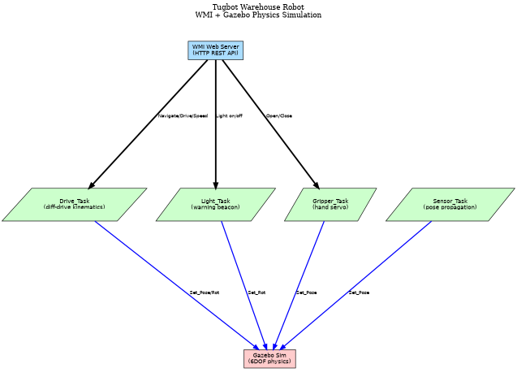

https://github.com/user-attachments/assets/99780fc4-36bd-48cd-9dc2-c48774ce0aa4

---

### 3. **[Humanoid Walking Robot](examples/HumanRobot)**
- Demonstrates real-time gait generation with partitioned multi-task controllers and direct integration to physics simulation.

https://github.com/user-attachments/assets/94e5f864-fd3c-449f-a605-af552ce06fcd

*Multi-task Ada controller driving a humanoid gait in Gazebo*

---

### 4. **[Autonomous Delivery Vehicle](examples/delivery_vehicle)**
- Orchestrates delivery by ground vehicle and drone launcher, with modular agent roles for inventory, navigation, and job scheduling.

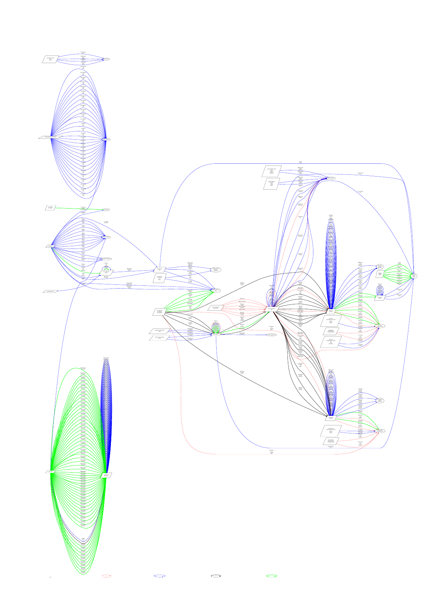

*DOT directed-graph trace of the concurrent agent interactions (generated via [`scripts/trace.sh`](scripts/trace.sh))*

---

### 5. **[SUV Control Simulation](examples/suv)**
- Showcases vehicle control via a Singleton agent, command processing, and modular assembly of subsystem models.

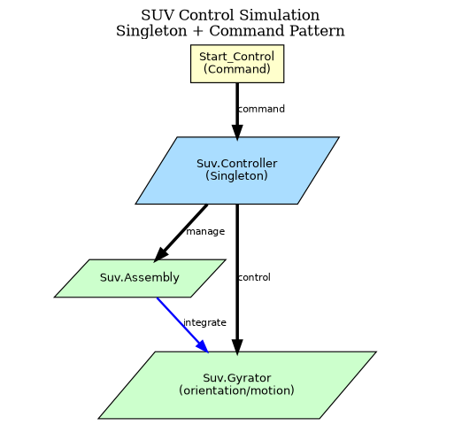

---

### 6. **[Publish/Subscribe Messaging](examples/toms)**
- Illustrates centralized and distributed broadcasting of system state and updates.

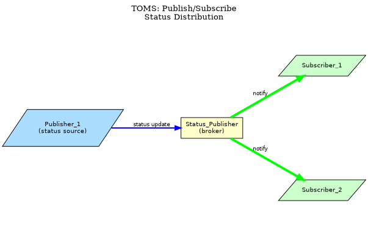

---

### 7. **[Multicast Telemetry](examples/mcast)**
- Shows non-blocking, unreliable communication for transient data among distributed agents.

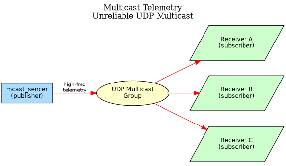

---

### 8. **[Embedded Traffic Light Controller](examples/traffic_light_controller)**
- Real-time control at a highway intersection, driven by timers, state variables, and remote interaction via P4.

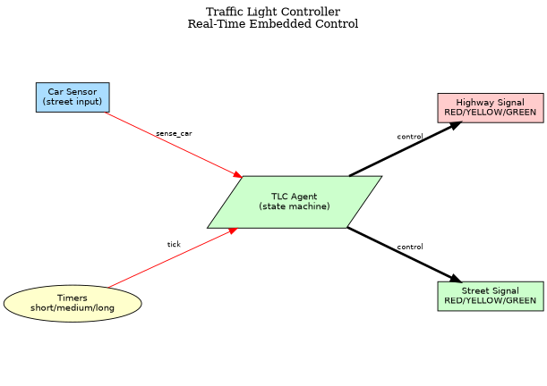

---

### 9. **[Gazebo 3D Earth-Moon-Sun Orbit](examples/gazebo_3d)**
- Demonstrates 6DOF motion feeding into Gazebo via shared memory, with Chandler wobble on Earth's axis.

https://github.com/user-attachments/assets/442b84ec-2e43-4ca8-b4fb-ce83bdc50ff1

*Earth-Moon-Sun orbit along the ecliptic*

https://github.com/user-attachments/assets/10b54951-cbc7-4ad0-a479-e17c9096dbc4

*Exaggerating the Chandler wobble by tracing out an extension of Earth's axis*

---

### 10. **[Panda Robot Joint Position Control](examples/joint_position_controller)**
- Controls a Franka Emika Panda robot's 7 arm joints and 2 gripper fingers with sinusoidal motion in Gazebo.

https://github.com/user-attachments/assets/6590e3e4-d3c2-4993-87bc-0b9b57978583

*Panda robot joint position control in Gazebo*

https://github.com/user-attachments/assets/4e2bb8cc-a83b-4e34-b099-41f48b6831ff

---

### 11. **[Real-Time 3D Robotic Arm](examples/robotic_arm_3d)**
- Controls a 2-joint robotic arm in real-time using sinusoidal link rotation commands via the Gazebo HAL.

https://github.com/user-attachments/assets/0ea9d45b-839f-4e1d-a0f9-dc24c6eae1ae

*Sinusoidal robotic arm motion in Gazebo (link-based control)*

https://github.com/user-attachments/assets/6ef645b6-0b28-4fd8-9fb8-0b77ddcc7e2c

---

### 12. **[Distributed Handshake](examples/distributed_handshake)**
- Three independent Ada nodes perform a circular propose → validate → confirm handshake over IPC sockets.

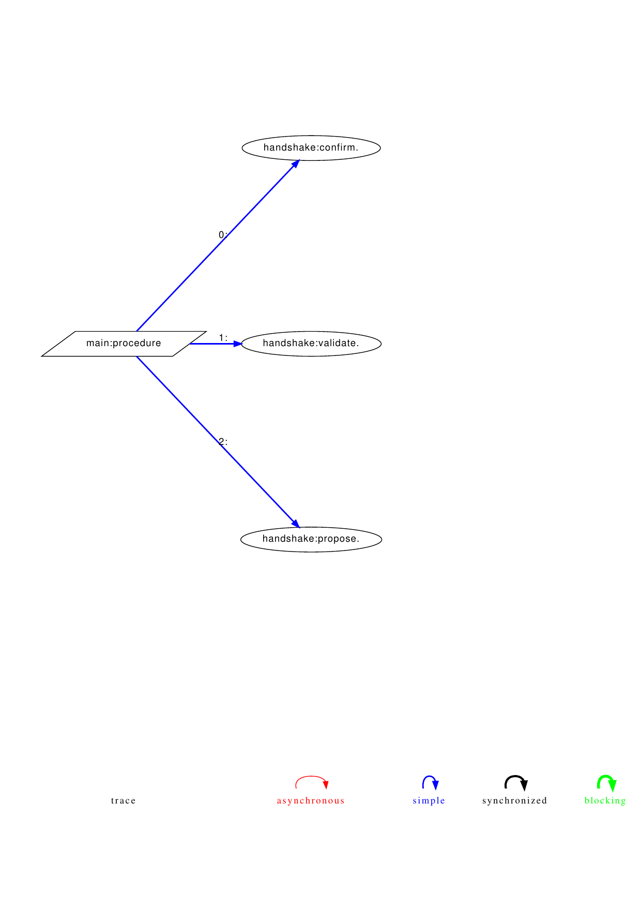

*Agent message trace: Node 1 → Node 2 → Node 3 → Node 1*

---

### 13. **[Gyrator IPC Example](examples/gyrator_example)**
- Minimal client/server demonstration of the PACE Remote Command pattern using IPC sockets.

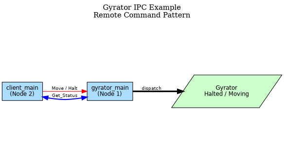

---

### 14. **[POST — Power-On Self Test](examples/post)**
- Sequential task orchestration: three independent agents chain `First → Second → Third → Fourth` operations.

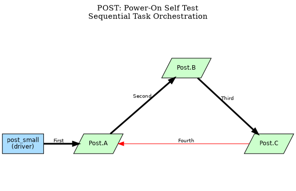

---

### 15. **[Ring Token Passing](examples/ring)**
- Classic circular token-ring topology: each node increments a value and forwards the token to the next.

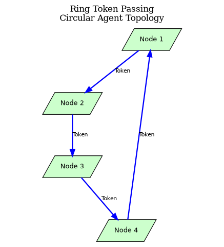

---

### 16. **[Distributed Maximum Finder](examples/max_finder)**
- Worker nodes generate Gaussian random values; a central server maintains a thread-safe running maximum.

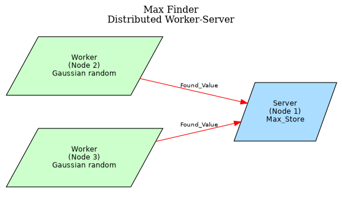

---

### 17. **[Discrete-Event Simulation Orchestra](examples/sim_orchestra)**
- Pure DES mode: Producer → Processor → Consumer pipeline running in simulated time (no wall-clock delays).

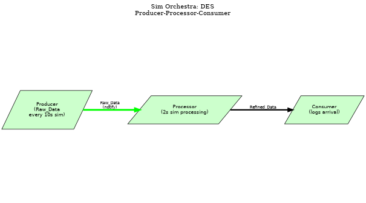

---

## Building and Running Examples

Each example is a GNAT Ada project, buildable with `gprbuild` and often runnable via simple shell scripts. Distributed examples use a session/proc launcher to start agents across one or more processes or machines.

For more details, explore the [examples directory on GitHub](https://github.com/pukpr/AdaPACE/tree/main/examples/) or consult each example's README file.

